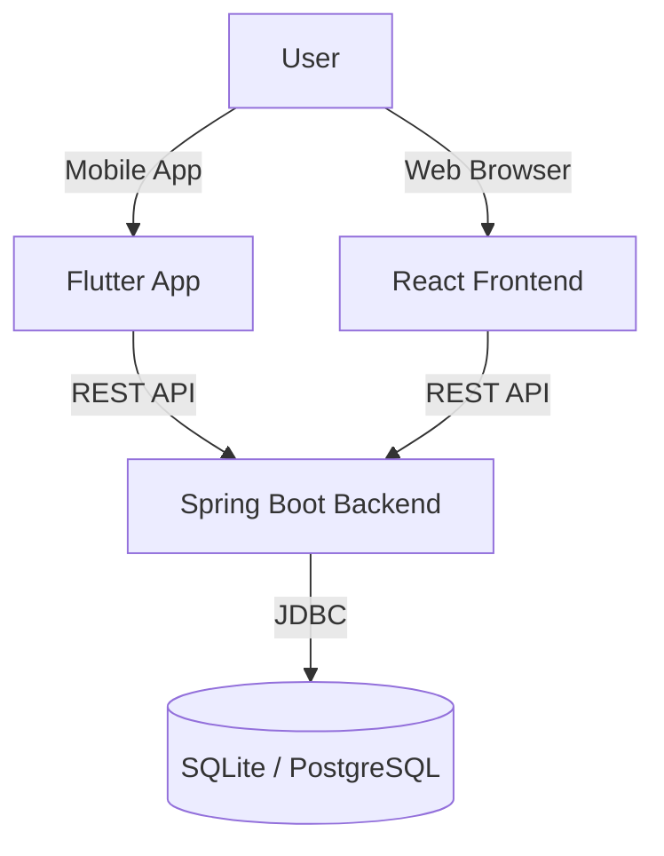

# Expense Tracker - Full Stack Application

A comprehensive expense tracking ecosystem comprising a **Web Dashboard**, **Mobile App**, and **REST Backend**. It features real-time expense tracking, automated email/SMS parsing, and financial insights.


## 🏗️ Architecture

The system follows a 3-tier architecture:



## 📂 Repositories

This mono-repo contains three distinct projects:

| Project | Path | Description | Tech Stack |
| :--- | :--- | :--- | :--- |
| **Backend** | [`/expense-tracker-backend`](./expense-tracker-backend) | Core API & Logic | Java 21, Spring Boot 3, Hibernate |
| **Frontend** | [`/expense-tracker-frontend`](./expense-tracker-frontend) | Web Dashboard | React, TypeScript, Vite, CSS Modules |
| **Mobile** | [`/expense-tracker-mobile`](./expense-tracker-mobile) | Android/iOS App | Flutter, Dart, Google Sign-In |

## 🚀 Quick Start Guide

### Prerequisites
*   **Java 21 JDK** (for Backend)
*   **Node.js 18+** (for Web)
*   **Flutter SDK** (for Mobile)
*   **Docker** (Optional, for deployment)

### 1. Start the Backend (Required)
The backend must be running for the frontend and mobile app to work.
```bash
cd expense-tracker-backend
./gradlew bootRun
```
*   Server: `http://localhost:8080`
*   Database: `expense-tracker.db` (Auto-created)

### 2. Start the Web Frontend
```bash
cd expense-tracker-frontend
npm install
npm run dev
```
*   App: `http://localhost:5173`

### 3. Start the Mobile App
```bash
cd expense-tracker-mobile
flutter pub get
flutter run
```

---

## ✨ Key Features

### 💰 Core Functionality
*   **Automated Tracking**: Parses bank emails (Gmail) and SMS (Android) to auto-log expenses.
*   **Manual Entry**: Quick-add interface for cash transactions.
*   **Smart Bill Management**: 
    *   Track recurring subscriptions and utilities.
    *   Auto-pay detection logic that links expenses to bills.
    *   Full lifecycle management (Create, Edit, Delete, Mark as Paid).

### 📊 Analytics
*   **Interactive Dashboard**: Visualize spending by category or timeframe (Daily/Weekly/Monthly).
*   **Budgeting**: Set monthly limits and see remaining balance at a glance.
*   **Dark Mode**: Sleek, modern interface enabled by default.

### 🔌 Integrations
*   **Google Sign-In**: Seamless authentication for mobile users.
*   **Gmail API**: Secure, read-only access to filter transaction emails.

---

## ☁️ Deployment

### Docker (Backend)
The backend is container-ready.
```bash
cd expense-tracker-backend
docker build -t expense-tracker-api .
docker run -p 8080:8080 expense-tracker-api
```

### Production Setup
*   **Database**: Switch from SQLite to PostgreSQL (Neon/AWS) for production.
*   **Frontend**: Deploy to Vercel, Netlify, or AWS S3.
*   **Mobile**: Distribute via Google Play Console and Apple App Store.

## 🤝 Contributing
1.  Fork the repository
2.  Create your feature branch (`git checkout -b feature/AmazingFeature`)
3.  Commit your changes (`git commit -m 'Add some AmazingFeature'`)
4.  Push to the branch (`git push origin feature/AmazingFeature`)
5.  Open a Pull Request

## 👤 Author
**Gokul Anbarasan**
